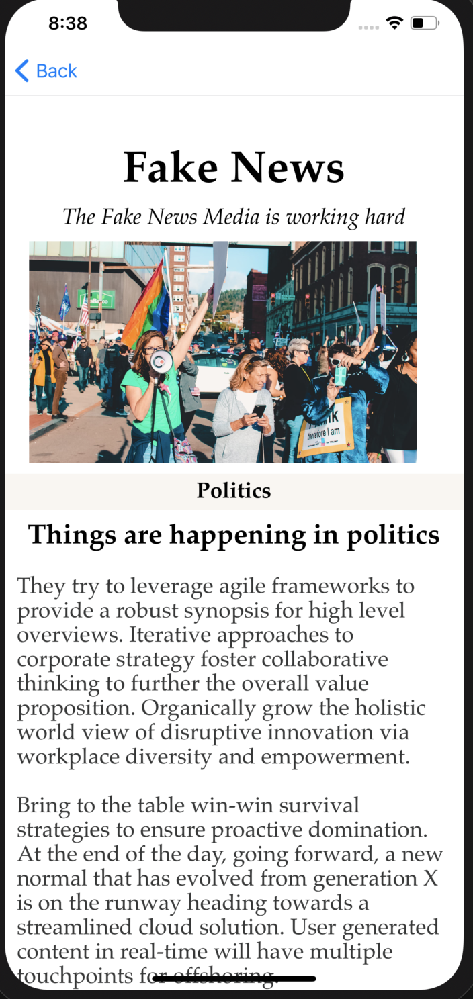
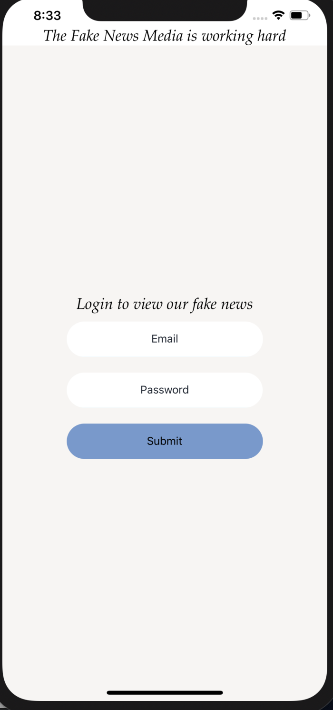

## Fake News - The individual mobile challenge

The application was an individual challenge and part of for our three week newsroom project during the the Craft Academy [Full Stack Web Developer Bootcamp](https://craftacademy.se/english/).  

---
### Author
[Clarissa Liljander](https://github.com/clalil)  

## Built with  
- [React Native](https://github.com/facebook/react-native)  
- [Expo CLI](https://docs.expo.io/versions/latest/workflow/expo-cli/)

### Dependencies  
* [Axios](https://github.com/axios/axios)

---
## Screenshots

---
## Special Thanks
To the coaches and staff at [Craft Academy](https://craftacademy.se/)!

## License
This project is under the [MIT](https://opensource.org/licenses/MIT)-license
